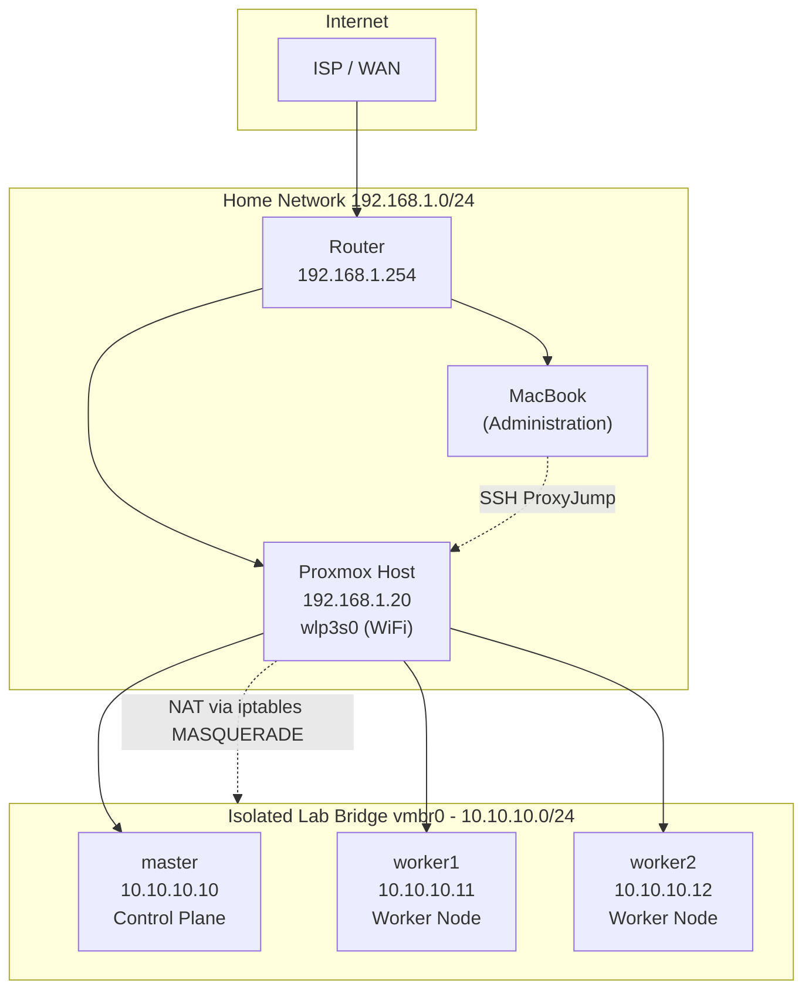

# Homelab: Proxmox + Kubernetes on a Single WiFi-Only Laptop

[](LICENSE)


A complete, from-scratch, production-style build log and reference implementation of a **3-node Kubernetes cluster** running as virtual machines on a **single Proxmox VE 9 host**, itself running on a consumer laptop that only has **WiFi — no Ethernet port in use**.

This repository is written as if it were official infrastructure documentation. Every command is explained. Every configuration file is annotated. Every networking decision — especially the unusual WiFi-bridging problem this hardware creates — is documented with the reasoning behind it, not just the steps.

If you are learning Proxmox, Kubernetes, or Linux networking from zero, this repo is designed so you can follow it end-to-end and end up with a fully working, `Ready` 3-node cluster with a CNI, and a Samba-backed network share mounted from macOS.

---

## Table of Contents

- [Why This Repository Exists](#why-this-repository-exists)
- [Hardware](#hardware)
- [High-Level Architecture](#high-level-architecture)
- [Network Architecture](#network-architecture)
- [Repository Structure](#repository-structure)
- [Documentation Index](#documentation-index)
- [Quick Start](#quick-start)
- [Scripts](#scripts)
- [Cluster Specifications](#cluster-specifications)
- [Design Decisions](#design-decisions)
- [Roadmap](#roadmap)
- [Contributing](#contributing)
- [License](#license)

---

## Why This Repository Exists

Most Kubernetes homelab tutorials assume you have a rack of machines connected via a physical switch with a dedicated Ethernet uplink per node. This homelab does not have that luxury: it runs on **one laptop**, with **one WiFi radio**, and **no Ethernet port in active use**. This constraint forces a specific set of networking decisions (an isolated NAT bridge, static IP assignment inside that bridge, and careful `iptables`/`sysctl` configuration) that are not well documented elsewhere.

This repository exists to:

1. Document the exact, reproducible steps used to go from a bare laptop to a working 3-node Kubernetes cluster.
2. Explain **why** each decision was made, not just **what** was run.
3. Serve as a reference for anyone building a Kubernetes homelab on constrained, WiFi-only consumer hardware.
4. Provide battle-tested scripts that automate the repetitive parts of the build.

> **Note:** This is a homelab / learning environment. It is not intended as a hardened, internet-facing production deployment. Where relevant, security hardening notes are called out separately from the "get it working" instructions.

---

## Hardware

| Component | Specification |
|---|---|
| Device | Lenovo Laptop |
| CPU | Intel i5, 4 physical cores |
| RAM | 16 GB |
| Primary Storage | 256 GB SSD |
| Secondary Storage | 1 TB HDD |
| Network | WiFi only (`wlp3s0`) — no Ethernet in use |
| Host OS | Proxmox VE 9 |

This is a **single-node Proxmox host**. All "nodes" in the Kubernetes cluster are virtual machines running on top of this one physical machine. This is a common and fully supported way to learn Kubernetes without owning a full rack of hardware — the tradeoff is that you are sharing 4 physical cores and 16 GB of RAM across the hypervisor and three guest VMs, which is discussed in [docs/14-Best-Practices.md](docs/14-Best-Practices.md).

---

## High-Level Architecture



The Proxmox host bridges its physical WiFi interface (`wlp3s0`) to the home network at `192.168.1.20`, while a **second, isolated virtual bridge** (`vmbr0`, `10.10.10.1/24`) hosts the three Kubernetes VMs. Because Linux cannot bridge a WiFi adapter directly to virtual machines (explained in full in [docs/02-Proxmox-Networking.md](docs/02-Proxmox-Networking.md)), NAT is used to give the VMs outbound internet access while keeping them on their own private subnet.

---

## Network Architecture

| Network | CIDR | Purpose |
|---|---|---|
| Home Network | `192.168.1.0/24` | Existing home WiFi network, managed by the router |
| Lab Bridge (`vmbr0`) | `10.10.10.0/24` | Isolated network for Proxmox guest VMs, NAT'd to the internet |
| Pod Network (Cilium) | `10.244.0.0/16` | Kubernetes pod-to-pod networking, managed by Cilium |

| Device | Address | Role |
|---|---|---|
| Router | `192.168.1.254` | Home gateway |
| Proxmox Host | `192.168.1.20` | Hypervisor, WiFi uplink, NAT gateway for `vmbr0` |
| Proxmox Host (bridge) | `10.10.10.1/24` | Gateway address for lab VMs |
| master | `10.10.10.10` | Kubernetes control plane |
| worker1 | `10.10.10.11` | Kubernetes worker node |
| worker2 | `10.10.10.12` | Kubernetes worker node |

Full networking rationale, `iptables` rules, and `/etc/network/interfaces` configuration are documented in [docs/02-Proxmox-Networking.md](docs/02-Proxmox-Networking.md).

---

## Repository Structure

```
homelab/
├── README.md                          # This file
├── LICENSE                            # MIT License
├── .gitignore                         # Ignore rules for secrets, kubeconfigs, etc.
├── docs/
│   ├── 01-Proxmox-Installation.md
│   ├── 02-Proxmox-Networking.md
│   ├── 03-Ubuntu-Template.md
│   ├── 04-Cloning-VMs.md
│   ├── 05-SSH.md
│   ├── 06-Kubernetes-Prerequisites.md
│   ├── 07-Kubeadm-ControlPlane.md
│   ├── 08-Kubeadm-Workers.md
│   ├── 09-Cilium.md
│   ├── 10-Cluster-Validation.md
│   ├── 11-Samba.md
│   ├── 12-Mac-Kubectl.md
│   ├── 13-Troubleshooting.md
│   ├── 14-Best-Practices.md
│   └── 15-Roadmap.md
├── scripts/
│   ├── install-kubernetes.sh          # Installs kubeadm/kubelet/kubectl + prerequisites
│   ├── worker-join.sh                 # Joins a worker node to the cluster
│   ├── reset-node.sh                  # Tears down a node's kubeadm state
│   ├── install-cilium.sh              # Installs the Cilium CNI via Helm/CLI
│   ├── mount-storage.sh               # Mounts the 1TB HDD and configures Samba
│   └── backup-config.sh               # Backs up cluster + Proxmox configuration
├── diagrams/
│   ├── network.drawio                 # Full network topology (draw.io)
│   ├── kubernetes.drawio              # Cluster component diagram (draw.io)
│   ├── storage.drawio                 # Storage/Samba diagram (draw.io)
│   └── architecture.drawio            # End-to-end system architecture (draw.io)
└── assets/
    ├── screenshots/                   # Placeholder for setup screenshots
    └── icons/                         # Placeholder for diagram icons
```

---

## Documentation Index

| # | Document | Description |
|---|---|---|
| 01 | [Proxmox Installation](docs/01-Proxmox-Installation.md) | Installing Proxmox VE 9 on the laptop, partitioning, first boot |
| 02 | [Proxmox Networking](docs/02-Proxmox-Networking.md) | The WiFi-bridging problem, `vmbr0`, NAT, `iptables`, `sysctl` |
| 03 | [Ubuntu Template](docs/03-Ubuntu-Template.md) | Building a reusable Ubuntu 26.04 cloud-init VM template |
| 04 | [Cloning VMs](docs/04-Cloning-VMs.md) | Cloning master/worker1/worker2 from the template |
| 05 | [SSH](docs/05-SSH.md) | SSH config, ProxyJump, key management from macOS |
| 06 | [Kubernetes Prerequisites](docs/06-Kubernetes-Prerequisites.md) | containerd, swap, kernel modules, sysctl, packages |
| 07 | [Kubeadm Control Plane](docs/07-Kubeadm-ControlPlane.md) | `kubeadm init`, kubeconfig, control-plane verification |
| 08 | [Kubeadm Workers](docs/08-Kubeadm-Workers.md) | Joining worker1 and worker2 to the cluster |
| 09 | [Cilium](docs/09-Cilium.md) | Installing and validating the Cilium CNI |
| 10 | [Cluster Validation](docs/10-Cluster-Validation.md) | End-to-end tests proving the cluster is healthy |
| 11 | [Samba](docs/11-Samba.md) | Mounting the 1TB HDD and sharing it via Samba |
| 12 | [Mac Kubectl](docs/12-Mac-Kubectl.md) | Configuring `kubectl` on macOS against the cluster |
| 13 | [Troubleshooting](docs/13-Troubleshooting.md) | Every issue encountered, root cause, and fix |
| 14 | [Best Practices](docs/14-Best-Practices.md) | Performance, security, and operational recommendations |
| 15 | [Roadmap](docs/15-Roadmap.md) | Planned additions: MetalLB, Ingress, GitOps, observability, etc. |

---

## Quick Start

> **Prerequisite:** You have already installed Proxmox VE 9 per [docs/01-Proxmox-Installation.md](docs/01-Proxmox-Installation.md) and configured networking per [docs/02-Proxmox-Networking.md](docs/02-Proxmox-Networking.md).

```bash
# 1. Clone this repository onto your administration machine (e.g. your Mac)
git clone https://github.com/<your-username>/homelab.git
cd homelab

# 2. Copy the installation script to each node and run it
scp scripts/install-kubernetes.sh master:~/
scp scripts/install-kubernetes.sh worker1:~/
scp scripts/install-kubernetes.sh worker2:~/

ssh master   "chmod +x install-kubernetes.sh && sudo ./install-kubernetes.sh"
ssh worker1  "chmod +x install-kubernetes.sh && sudo ./install-kubernetes.sh"
ssh worker2  "chmod +x install-kubernetes.sh && sudo ./install-kubernetes.sh"

# 3. Initialize the control plane on master (see docs/07)
ssh master "sudo kubeadm init --pod-network-cidr=10.244.0.0/16"

# 4. Join the workers (see docs/08 and scripts/worker-join.sh)
scp scripts/worker-join.sh worker1:~/
scp scripts/worker-join.sh worker2:~/
ssh worker1 "sudo ./worker-join.sh"
ssh worker2 "sudo ./worker-join.sh"

# 5. Install Cilium (see docs/09 and scripts/install-cilium.sh)
scp scripts/install-cilium.sh master:~/
ssh master "./install-cilium.sh"

# 6. Validate the cluster (see docs/10)
ssh master "kubectl get nodes -o wide"
```

Each step above is explained in exhaustive detail in the linked documents — this is only a summary for readers who already understand the process and want the command sequence.

---

## Scripts

| Script | Purpose |
|---|---|
| [scripts/install-kubernetes.sh](scripts/install-kubernetes.sh) | Installs containerd, kubeadm, kubelet, kubectl, and configures all Kubernetes prerequisites on a node |
| [scripts/worker-join.sh](scripts/worker-join.sh) | Wraps `kubeadm join` with pre-flight checks and safe defaults |
| [scripts/reset-node.sh](scripts/reset-node.sh) | Fully resets a node's `kubeadm`/CNI state so it can be re-joined cleanly |
| [scripts/install-cilium.sh](scripts/install-cilium.sh) | Installs the Cilium CLI and deploys Cilium as the cluster CNI |
| [scripts/mount-storage.sh](scripts/mount-storage.sh) | Mounts the NTFS 1TB HDD via `/etc/fstab` and prepares it for Samba sharing |
| [scripts/backup-config.sh](scripts/backup-config.sh) | Archives Proxmox and Kubernetes configuration for disaster recovery |

Every script includes `set -euo pipefail`, inline comments, usage banners, and safety checks. See each script's header for usage instructions.

---

## Cluster Specifications

| Node | Hostname | IP | vCPU | RAM | Disk | Role |
|---|---|---|---|---|---|---|
| VM 1 | `master` | `10.10.10.10` | 2 | 2 GB | 35 GB | Control Plane |
| VM 2 | `worker1` | `10.10.10.11` | 2 | 2 GB | 35 GB | Worker |
| VM 3 | `worker2` | `10.10.10.12` | 2 | 2 GB | 35 GB | Worker |

| Software | Version |
|---|---|
| Proxmox VE | 9 |
| Ubuntu Server | 26.04 |
| Kubernetes (kubeadm/kubelet/kubectl) | v1.34 |
| Container Runtime | containerd (`SystemdCgroup=true`) |
| CNI | Cilium |
| Pod Network CIDR | `10.244.0.0/16` |

---

## Design Decisions

A summary of the non-obvious decisions made in this homelab, each expanded upon in its relevant doc:

- **Isolated NAT bridge instead of a bridged WiFi adapter** — WiFi adapters cannot be Layer-2 bridged the way Ethernet adapters can, because of how 802.11 association works. See [docs/02-Proxmox-Networking.md](docs/02-Proxmox-Networking.md).
- **VirtIO for both network and disk** — paravirtualized drivers dramatically outperform emulated `e1000`/`IDE` devices, which matters when 3 VMs share 4 physical cores. See [docs/03-Ubuntu-Template.md](docs/03-Ubuntu-Template.md).
- **Cilium over other CNIs** — chosen for its eBPF data plane, built-in `Hubble` observability, and first-class support for `NetworkPolicy` without requiring `kube-proxy` in strict mode. See [docs/09-Cilium.md](docs/09-Cilium.md).
- **SSH ProxyJump instead of exposing VM SSH ports on the home network** — keeps the entire `10.10.10.0/24` lab network unreachable from anywhere except through the Proxmox host itself. See [docs/05-SSH.md](docs/05-SSH.md).
- **Samba instead of NFS for the HDD share** — the primary client is macOS, where Samba (SMB3) offers native Finder integration and Time Machine support that NFS does not provide as cleanly on macOS. See [docs/11-Samba.md](docs/11-Samba.md).

---

## Roadmap

This cluster is intentionally built incrementally. See [docs/15-Roadmap.md](docs/15-Roadmap.md) for the full plan, which includes MetalLB, NGINX Ingress, cert-manager, Longhorn, NFS, Harbor, ArgoCD, FluxCD, Prometheus, Grafana, Loki, Promtail, Falco, Trivy, Kyverno, OPA Gatekeeper, ExternalDNS, Velero, GitHub Actions, Terraform, and Ansible.

---

## Contributing

This repository documents a personal homelab, but corrections, clarifications, and PRs that improve accuracy or clarity are welcome. Please open an issue describing the environment (Proxmox version, kernel, Kubernetes version) if you hit a problem this documentation doesn't cover.

---

## License

This project is licensed under the MIT License — see [LICENSE](LICENSE) for details.
