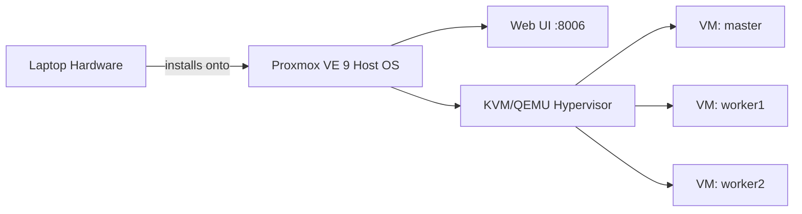

# 01 — Proxmox Installation

## Overview

This document covers installing **Proxmox VE 9** onto the Lenovo laptop that serves as the sole physical host for this entire homelab. By the end of this document you will have a running Proxmox hypervisor reachable at `192.168.1.20` on your home network, ready to receive the networking configuration in [02-Proxmox-Networking.md](02-Proxmox-Networking.md).

> **Why Proxmox?** Proxmox VE is a free, open-source Type-1 (bare-metal) hypervisor built on Debian and KVM/QEMU, with an integrated web UI, built-in container support (LXC), and a mature CLI (`qm`, `pct`) that make it an excellent fit for a homelab where you want production-like tooling without a commercial license.

---

## Architecture



Proxmox VE replaces any existing OS on the laptop — this is a **bare-metal install**, not a hosted hypervisor running inside another OS. The installer partitions the local disks, installs a Debian-based host OS, and layers the Proxmox management stack (`pve-manager`, `pve-cluster`, `qemu-server`, `corosync`, etc.) on top.

---

## Hardware Inventory (Reference)

| Component | Spec |
|---|---|
| CPU | Intel i5, 4 physical cores |
| RAM | 16 GB |
| SSD | 256 GB (Proxmox host + VM disks) |
| HDD | 1 TB (network storage, see [11-Samba.md](11-Samba.md)) |
| Network | WiFi only (`wlp3s0`), no Ethernet in use |

> **Warning:** Proxmox's own installer does not officially support installing over WiFi — the installer environment expects a wired NIC for network configuration during setup. In this build, WiFi is configured **after** the base install completes, using the `wlp3s0` interface directly from the Proxmox host shell. If your installer detects no network during setup, you can safely skip network configuration in the installer and complete it post-install, as described below.

---

## Step 1: Download the Installer

Download the Proxmox VE 9 ISO from the official Proxmox downloads page and verify its checksum before writing it to media.

```bash
# On your administration machine (macOS/Linux)
shasum -a 256 proxmox-ve_9.0-1.iso
```

Compare the output against the SHA256 checksum published alongside the ISO on the Proxmox website. This step matters because a corrupted or tampered installer image can produce a host that fails unpredictably later, and those failures are far harder to diagnose than a checksum mismatch caught up front.

## Step 2: Create Bootable Installation Media

```bash
# macOS example — replace /dev/diskN with your USB device (use `diskutil list` to identify it)
diskutil unmountDisk /dev/diskN
sudo dd if=proxmox-ve_9.0-1.iso of=/dev/rdiskN bs=1m
```

> **Tip:** Use `/dev/rdiskN` (the **raw** disk device) rather than `/dev/diskN` on macOS — writing through the raw device is dramatically faster because it bypasses the buffer cache.

## Step 3: Boot the Installer

1. Insert the USB drive into the laptop.
2. Enter the boot menu (commonly `F12`, `F2`, or `Esc` depending on the Lenovo model) and select the USB device.
3. Choose **Install Proxmox VE (Graphical)** at the boot splash.

## Step 4: Disk Selection and Partitioning

The installer will present a target disk. Select the **256 GB SSD** as the installation target — this SSD will hold the Proxmox host OS plus all three VM disks (35 GB × 3 = 105 GB, leaving comfortable headroom for ISOs and templates).

> **Note:** The 1 TB HDD is intentionally **not** selected here. It is reserved for network storage and mounted separately in [11-Samba.md](11-Samba.md). Keeping the hypervisor's boot/VM disk separate from bulk storage avoids I/O contention between VM disk operations and large file transfers over Samba.

Under **Filesystem**, `ext4` is a safe, well-understood default for a single-disk homelab install. (Proxmox also offers ZFS, which brings snapshots and checksumming, but ZFS's RAM overhead is a poor fit for a 16 GB host that also needs to run three VMs — this tradeoff is discussed further in [14-Best-Practices.md](14-Best-Practices.md).)

## Step 5: Location, Time Zone, and Root Credentials

Set your country, time zone, and keyboard layout, then set a **strong root password** and a valid administrator email (used for Proxmox's built-in mail-based alerting, e.g. for backup job failures).

> **Warning:** The root password set here is the password for the Proxmox host itself — it grants full control over every VM. Store it in a password manager immediately; do not rely on memory.

## Step 6: Network Configuration

If the installer detects a network interface, it will ask you to configure a hostname, IP address, gateway, and DNS server. Since this host has no active Ethernet connection at install time, the installer's WiFi support is typically absent or non-functional. In that case:

1. Accept the installer's default/placeholder network values (they can be changed after install).
2. Proceed with installation.
3. Configure WiFi networking manually after first boot, as shown in Step 8 below and expanded in [02-Proxmox-Networking.md](02-Proxmox-Networking.md).

If your installer **does** detect `wlp3s0` and offers to configure it directly, you can set:

| Field | Value |
|---|---|
| Hostname (FQDN) | `pve.homelab.local` |
| IP Address (CIDR) | `192.168.1.20/24` |
| Gateway | `192.168.1.254` |
| DNS Server | `192.168.1.254` (or `1.1.1.1`) |

## Step 7: Installation

Confirm the summary screen and begin installation. This takes roughly 5–10 minutes on SSD-class storage. The laptop will reboot automatically when complete — remove the USB installer media during reboot to avoid re-launching the installer.

## Step 8: First Boot and WiFi Bring-Up

After reboot, Proxmox drops you to a console login (`root` + the password from Step 5). If WiFi was not configured by the installer, bring it up manually:

```bash
# Identify the wireless interface name
ip link show

# Install wireless tools and wpa_supplicant if not already present
apt update
apt install -y wireless-tools wpasupplicant

# Generate a WPA configuration for your home WiFi
wpa_passphrase "YourSSID" "YourWiFiPassword" > /etc/wpa_supplicant/wpa_supplicant-wlp3s0.conf
```

Then configure `/etc/network/interfaces` to bring `wlp3s0` up as a DHCP or static client of your home network:

```
auto wlp3s0
iface wlp3s0 inet static
    address 192.168.1.20/24
    gateway 192.168.1.254
    wpa-conf /etc/wpa_supplicant/wpa_supplicant-wlp3s0.conf
```

Apply the change:

```bash
ifreload -a
# or, if ifreload is unavailable:
systemctl restart networking
```

> **Note:** Full detail on why `wlp3s0` is treated this way — and why it is deliberately **kept separate** from the bridge that serves the VMs — is in [02-Proxmox-Networking.md](02-Proxmox-Networking.md). This is the single most important networking decision in this entire homelab.

## Step 9: Verify Connectivity

```bash
ping -c 4 192.168.1.254
ping -c 4 1.1.1.1
```

**Expected output:** 4 packets transmitted, 4 received, 0% packet loss, for both the gateway and the public IP. If the gateway ping succeeds but the public IP ping fails, your issue is upstream of the router (ISP or router WAN configuration) — not a Proxmox problem.

## Step 10: Access the Web UI

From your administration machine's browser:

```
https://192.168.1.20:8006
```

Accept the self-signed certificate warning (Proxmox generates its own cert on install; replacing it with a trusted cert is optional and out of scope for a private homelab) and log in as `root` with the password from Step 5.

**Expected result:** The Proxmox dashboard loads, showing one node (`pve`) with CPU, memory, and storage summary graphs beginning to populate.

---

## Verification Checklist

- [ ] `ping 192.168.1.254` succeeds from the Proxmox host
- [ ] `ping 1.1.1.1` succeeds from the Proxmox host (confirms NAT/internet at the router level)
- [ ] Web UI loads at `https://192.168.1.20:8006`
- [ ] `pveversion` reports Proxmox VE 9.x
- [ ] `pvesm status` shows the local storage as `active`

```bash
pveversion
pvesm status
```

---

## Common Mistakes

| Mistake | Consequence | Fix |
|---|---|---|
| Selecting the 1 TB HDD as the install target | VM disks and bulk storage compete for I/O; no separation of concerns | Reinstall targeting the 256 GB SSD only |
| Forgetting the root password immediately after setting it | Full lockout from both console and Web UI | Reset via a Proxmox rescue boot; better yet, store passwords in a manager the moment they're created |
| Assuming the installer will handle WiFi like Ethernet | Installer network step silently fails or is skipped | Configure WiFi manually post-install as shown in Step 8 |
| Using DHCP for the Proxmox host's WiFi address | Host IP can change on router reboot, breaking SSH configs and bookmarks | Use a static IP (`192.168.1.20/24`) or a DHCP reservation on the router |

---

## Troubleshooting

**Symptom: Installer hangs at "Copying files" for a very long time.**
Likely cause: USB installer media written at low speed or a marginal USB port. Fix: re-write the ISO using a raw device path (`/dev/rdiskN` on macOS) and a USB 3.0 port if available.

**Symptom: No network interface shown in installer.**
Expected on WiFi-only hardware — Proxmox's installer environment does not include WiFi drivers/`wpa_supplicant` configuration tooling by default. This is not a failure; proceed with installation and configure networking in Step 8.

**Symptom: `https://192.168.1.20:8006` refuses to connect.**
Check, in order: (1) is the host powered on and did it fully boot past the console login? (2) does `ip a show wlp3s0` show the expected `192.168.1.20` address? (3) is a firewall on your administration machine blocking outbound 8006? (4) from the Proxmox console itself, does `curl -k https://localhost:8006` return HTML? If yes, the service is fine and the problem is network-path related.

---

## Recovery

If the host becomes unreachable and you cannot recall the network configuration applied:

1. Attach a physical monitor and keyboard directly to the laptop (or use Proxmox's serial console if configured).
2. Log in at the console with `root`.
3. Re-run `ip a` to inspect current interface state, and re-apply `/etc/network/interfaces` as shown in Step 8.
4. If root credentials are lost entirely, boot from the Proxmox ISO again and use the rescue/recovery option to reset the root password from a chroot — this does **not** touch VM disks and is safe to do without affecting the Kubernetes cluster.

---

## Best Practices

- Set a static IP for the Proxmox host rather than relying on DHCP; every other document in this repository (SSH config, `kubectl` config, Samba) assumes `192.168.1.20` never changes.
- Enable Proxmox's built-in email alerts (`Datacenter → root@pam → Two Factor` is separate from alerting — configure alerting via `Datacenter → Notifications`) so backup and replication failures reach you.
- Keep a physical/local console access method available (even just noting where the laptop physically is) — a WiFi-only host that loses its network configuration has no other management path.

## Performance Tips

- Use `ext4` rather than ZFS for a single-SSD, 16 GB RAM host — ZFS's ARC cache and checksumming overhead compete directly with the RAM your VMs need.
- Disable any Proxmox subscription "nag" repository misconfiguration by switching to the free `pve-no-subscription` repository (`/etc/apt/sources.list.d/pve-install-repo.list`) so `apt update` doesn't fail against the enterprise repo you don't have a license for.

## Security Tips

- Change the default self-signed certificate warning behavior only if you plan to expose the UI beyond your LAN (not recommended for this homelab).
- Restrict Web UI access (`https://192.168.1.20:8006`) to your home network only; never port-forward 8006 to the internet.
- Consider enabling two-factor authentication on the `root@pam` account under **Datacenter → Permissions → Two Factor**.

---

**Next:** [02-Proxmox-Networking.md](02-Proxmox-Networking.md) — the isolated bridge, NAT, and why WiFi adapters cannot be bridged directly.
