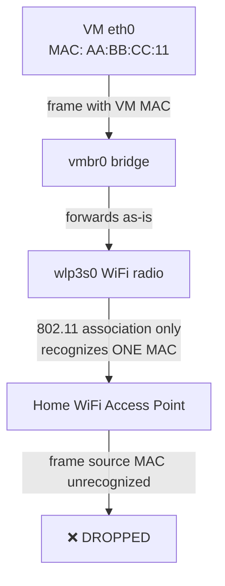
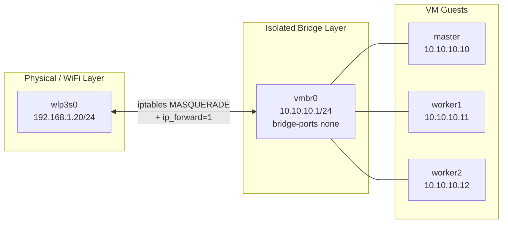

# 02 — Proxmox Networking: The WiFi Bridge Problem

## Overview

This is the most important document in the repository. Every other decision in this homelab — how the VMs get IP addresses, how SSH reaches them, how Samba is exposed — depends on the networking model established here. This document explains **why** a WiFi-only laptop cannot use the "normal" Proxmox networking pattern, and what was built instead.

---

## The Problem: WiFi Adapters Cannot Be Bridged

On a typical Proxmox install with an Ethernet NIC, you create a Linux bridge (`vmbr0`) and attach the physical NIC to it as a bridge port:

```
auto vmbr0
iface vmbr0 inet static
    address 192.168.1.20/24
    gateway 192.168.1.254
    bridge-ports eno1
    bridge-stp off
    bridge-fd 0
```

This works because Ethernet operates at Layer 2 in a way that lets a bridge transparently forward frames with **arbitrary source MAC addresses** — each VM gets its own MAC address, and the switch on the other end of the Ethernet cable happily learns and forwards frames for all of them.

**WiFi does not work this way.** An 802.11 association is a Layer-2 relationship between exactly one client MAC address and the access point. When you try to bridge a WiFi interface (`wlp3s0`) the same way:



The access point only recognizes frames from the MAC address that completed the WiFi association (the Proxmox host's own `wlp3s0` MAC). Frames bridged through from a VM carry the **VM's** MAC address, which the AP has no association record for, and it silently discards them. This is why people report "the bridge shows link, but VMs get no DHCP lease and no connectivity" when they try to bridge WiFi — this is expected 802.11 behavior, not a misconfiguration.

> **Note:** Some workarounds exist (4addr/WDS mode, or `macvlan` combined with promiscuous mode on APs that support it), but they require access-point support this home router does not have, and they are fragile even when supported. The isolated-bridge + NAT approach below is the standard, robust solution for WiFi-only hypervisor hosts.

---

## The Solution: An Isolated Bridge with NAT

Instead of bridging `wlp3s0`, this homelab creates a **second, fully isolated Linux bridge** with no physical ports attached at all, and routes traffic from it to the internet using NAT (masquerading) through `wlp3s0`.



`vmbr0` has `bridge-ports none` — it is a purely virtual switch that exists only in software, connecting the three VMs' virtual NICs to each other and to the Proxmox host's own `vmbr0` interface (`10.10.10.1`). It has **no physical port**, so the "bridging a WiFi adapter" problem never arises: `vmbr0` never touches `wlp3s0` at Layer 2 at all.

Instead, the Proxmox host acts as a **router** between the two networks: it forwards IP packets (Layer 3) from `10.10.10.0/24` out through `wlp3s0` to the internet, rewriting the source address via NAT so return traffic comes back correctly. This is exactly how your home router itself provides internet access to your laptop and phone — the same mechanism, one layer further in.

---

## Configuration: `/etc/network/interfaces`

```
# The physical WiFi uplink — unchanged from Section 01
auto wlp3s0
iface wlp3s0 inet static
    address 192.168.1.20/24
    gateway 192.168.1.254
    wpa-conf /etc/wpa_supplicant/wpa_supplicant-wlp3s0.conf

# The isolated bridge for Kubernetes VMs — NOTE: bridge-ports none
auto vmbr0
iface vmbr0 inet static
    address 10.10.10.1/24
    bridge-ports none
    bridge-stp off
    bridge-fd 0
    post-up   iptables -t nat -A POSTROUTING -s 10.10.10.0/24 -o wlp3s0 -j MASQUERADE
    post-down iptables -t nat -D POSTROUTING -s 10.10.10.0/24 -o wlp3s0 -j MASQUERADE
```

| Directive | Explanation |
|---|---|
| `bridge-ports none` | Explicitly declares this bridge has no physical uplink — it is purely for inter-VM and VM-to-host traffic. This is the key line that avoids the WiFi bridging problem entirely. |
| `address 10.10.10.1/24` | The Proxmox host's own address on the isolated network — this becomes the **gateway** each VM points to. |
| `post-up iptables ... MASQUERADE` | Rewrites the source IP of outbound packets from `10.10.10.0/24` to the host's `wlp3s0` address, so the home router (and internet) can route return traffic back correctly. Runs automatically whenever the interface comes up. |
| `post-down iptables -D ...` | Removes the same rule on interface teardown, keeping the `iptables` NAT table clean across restarts/reconfigurations. |

Apply the configuration:

```bash
ifreload -a
```

**Expected output:** no errors; `ip a show vmbr0` shows `10.10.10.1/24` with state `UP`.

---

## Enabling IP Forwarding

NAT alone is not enough — the Linux kernel must be told to actually **forward** packets between interfaces rather than only accepting packets addressed to itself. This is controlled by `net.ipv4.ip_forward`.

```bash
# Immediate effect (does not survive reboot)
sysctl -w net.ipv4.ip_forward=1

# Persistent effect
cat <<'EOF' >> /etc/sysctl.conf
net.ipv4.ip_forward=1
EOF
sysctl -p
```

> **Warning:** If you forget this step, VMs will show a properly configured IP address and can reach the Proxmox host itself (`10.10.10.1`) and each other, but **all internet-bound traffic will silently time out**. This is one of the most common "my VM has no internet" homelab bugs and is easy to miss because the bridge and NAT rule both look correct.

---

## VM-Side Configuration

Each VM (`master`, `worker1`, `worker2`) is configured with a **static IP** on the `10.10.10.0/24` network, using `10.10.10.1` as its gateway:

```yaml
# Example netplan config on master (/etc/netplan/50-cloud-init.yaml)
network:
  version: 2
  ethernets:
    ens18:
      addresses: [10.10.10.10/24]
      routes:
        - to: default
          via: 10.10.10.1
      nameservers:
        addresses: [1.1.1.1, 8.8.8.8]
```

Static IPs (rather than DHCP) are used because Kubernetes control-plane certificates and `kubeadm` join tokens are generated against specific IP addresses — an address that changed after a DHCP lease renewal would silently break cluster communication. This is expanded on in [06-Kubernetes-Prerequisites.md](06-Kubernetes-Prerequisites.md).

---

## Verification

```bash
# On the Proxmox host
ip a show vmbr0                       # expect: 10.10.10.1/24, state UP
iptables -t nat -L POSTROUTING -n -v  # expect: MASQUERADE rule for 10.10.10.0/24
sysctl net.ipv4.ip_forward            # expect: net.ipv4.ip_forward = 1

# From a VM
ping -c 4 10.10.10.1     # gateway reachable
ping -c 4 1.1.1.1        # internet reachable via NAT
ping -c 4 google.com     # DNS resolution + internet reachable
```

---

## Common Mistakes

| Mistake | Symptom | Fix |
|---|---|---|
| Attaching `wlp3s0` as a `vmbr0` bridge port | VMs get link but no working connectivity; AP silently drops frames from VM MACs | Use `bridge-ports none` and NAT instead |
| Forgetting `net.ipv4.ip_forward=1` | VMs can reach the host and each other, but not the internet | Set and persist the sysctl as shown above |
| Using DHCP inside the `10.10.10.0/24` network without a DHCP server | VMs get no address at all (no DHCP server exists on this isolated network) | Use static addressing, or run `dnsmasq` on the host if DHCP is preferred |
| Forgetting to persist the `iptables` rule | NAT rule disappears on reboot, VMs lose internet after every host restart | Use the `post-up`/`post-down` hooks in `/etc/network/interfaces` shown above, or install `iptables-persistent` |

---

## Troubleshooting

**Symptom: `vmbr0` shows `linkdown` in the Proxmox Web UI.**
This is often cosmetic for a bridge with `bridge-ports none` — since there is no physical port, some UI versions report `linkdown` even though the bridge is fully functional for VM-to-VM and VM-to-host traffic. Verify with `ip a show vmbr0` and confirm the address is present and the state is `UNKNOWN` or `UP` at the interface level, then confirm with an actual `ping` test rather than trusting the UI's link icon alone.

**Symptom: VMs can ping `10.10.10.1` but nothing beyond it.**
Check `sysctl net.ipv4.ip_forward` — if it reports `0`, forwarding is disabled and this is expected behavior, not a NAT bug.

**Symptom: NAT worked, then stopped after a reboot.**
Check `iptables -t nat -L POSTROUTING -n -v` for the `MASQUERADE` rule. If it's missing, the `post-up` hook did not fire — verify the exact syntax in `/etc/network/interfaces` matches what's shown above (a missing `-o wlp3s0` or transposed `-A`/`-D` between `post-up`/`post-down` is a common typo).

---

## Recovery

If networking is broken badly enough that VMs are entirely unreachable but the Proxmox host itself is fine:

```bash
# Rebuild the bridge and NAT rule from scratch
ip link set vmbr0 down
ip addr flush dev vmbr0
ifreload -a
iptables -t nat -A POSTROUTING -s 10.10.10.0/24 -o wlp3s0 -j MASQUERADE
sysctl -w net.ipv4.ip_forward=1
```

---

## Best Practices

- Keep the lab network (`10.10.10.0/24`) numerically distinct from the home network (`192.168.1.0/24`) so routing tables and firewall rules are never ambiguous.
- Document (as done here) that `vmbr0` is intentionally isolated — a future you (or a collaborator) seeing `bridge-ports none` without this context might "fix" it by adding `wlp3s0` and break everything.

## Performance Tips

- NAT introduces negligible overhead on modern hardware for a homelab's traffic volume; there is no meaningful performance reason to avoid this pattern.
- Keep the pod network CIDR (`10.244.0.0/16`, see [09-Cilium.md](09-Cilium.md)) non-overlapping with both `10.10.10.0/24` and `192.168.1.0/24` — this is already satisfied by the addressing plan in this repository.

## Security Tips

- Because `vmbr0` is NAT'd, not port-forwarded, nothing on the `10.10.10.0/24` network is reachable **from** the home network or the internet — only outbound connections are permitted. This is a meaningful security boundary for a homelab: the Kubernetes API server, `kubelet`, and Samba share are only reachable through the Proxmox host.
- If you need to reach a VM's service from your Mac (e.g. `kubectl` or SSH), the correct approach is `ProxyJump` through the Proxmox host (see [05-SSH.md](05-SSH.md)) or `kubectl port-forward`/`kubectl proxy` — not opening inbound NAT rules on `wlp3s0`.

---

**Next:** [03-Ubuntu-Template.md](03-Ubuntu-Template.md) — building a reusable Ubuntu 26.04 VM template with cloud-init.
