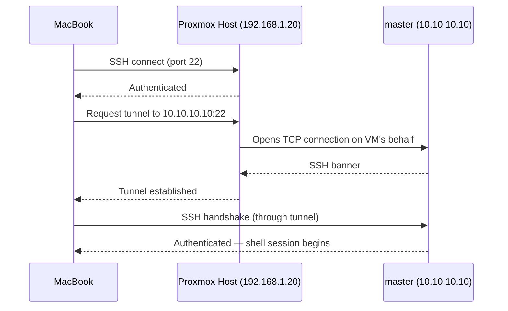

# 05 — SSH Access via ProxyJump

## Overview

Because the three cluster VMs live on the isolated `10.10.10.0/24` network (see [02-Proxmox-Networking.md](02-Proxmox-Networking.md)), they are **not directly reachable** from the home network or from your MacBook. This document configures SSH `ProxyJump` so that the Proxmox host (`192.168.1.20`) transparently relays SSH connections to each VM, without ever exposing the VMs' SSH ports on the home network.

---

## Why ProxyJump Instead of Port Forwarding

An alternative approach would be to forward, say, `192.168.1.20:2201 → 10.10.10.10:22` using `iptables` DNAT rules, then SSH to `192.168.1.20:2201`. This works, but it:

- Requires a separate forwarded port per VM, which doesn't scale as nodes are added.
- Opens additional listening ports on the Proxmox host that must be individually tracked and secured.
- Provides no visibility that you're "hopping through" the Proxmox host — it's easy to forget the topology.

`ProxyJump` (`-J` / `ProxyJump` in `ssh_config`) instead uses the Proxmox host purely as a relay for a single SSH session — OpenSSH opens a connection to the jump host, then tunnels a second SSH connection to the final destination through it. No additional ports are opened; the Proxmox host's normal SSH daemon (port 22) is the only thing exposed on the home network.



---

## Step 1: Generate an SSH Key Pair (if you don't already have one)

```bash
# On your MacBook
ssh-keygen -t ed25519 -C "homelab-admin" -f ~/.ssh/id_ed25519
```

`ed25519` is preferred over `rsa` for new keys: smaller key size, faster verification, and equivalent or stronger security for this use case.

## Step 2: Authorize the Key on the Proxmox Host

```bash
ssh-copy-id root@192.168.1.20
```

This appends your public key to `/root/.ssh/authorized_keys` on the Proxmox host, enabling password-less login as `root`.

> **Note:** The VMs themselves already trust this same key pair, because it was baked into the cloud-init template in [03-Ubuntu-Template.md](03-Ubuntu-Template.md) via `qm set 9000 --sshkeys ~/.ssh/id_ed25519.pub`. No separate `ssh-copy-id` step is required per VM.

## Step 3: Configure `~/.ssh/config`

```
Host proxmox
    HostName 192.168.1.20
    User root

Host master
    HostName 10.10.10.10
    User vm1
    ProxyJump root@192.168.1.20

Host worker1
    HostName 10.10.10.11
    User vm1
    ProxyJump root@192.168.1.20

Host worker2
    HostName 10.10.10.12
    User vm1
    ProxyJump root@192.168.1.20
```

| Field | Explanation |
|---|---|
| `Host master` (etc.) | A short alias — `ssh master` is all that's needed going forward. |
| `HostName 10.10.10.10` | The VM's actual address on the isolated bridge. |
| `User vm1` | The cloud-init default user baked into the template. |
| `ProxyJump root@192.168.1.20` | Tells OpenSSH to first connect to `192.168.1.20` as `root`, then tunnel the real connection to `10.10.10.10` through that session. |

## Step 4: Connect

```bash
ssh master
ssh worker1
ssh worker2
```

**Expected result:** each command opens a shell directly on the target VM, with no manual two-hop process required — OpenSSH handles the jump transparently based on the config above.

---

## Verification

```bash
ssh master  "hostname && ip a show ens18 | grep inet"
```

**Expected output:** `master` and an inet line showing `10.10.10.10/24`.

Run the equivalent for `worker1` and `worker2`, confirming each reports its own correct hostname and IP.

---

## Common Mistakes

| Mistake | Consequence | Fix |
|---|---|---|
| Using `ProxyCommand` with manual `nc`/`ssh -W` syntax instead of `ProxyJump` | Works, but far more error-prone and harder to read/maintain | Use the modern `ProxyJump` directive (OpenSSH 7.3+), as shown above |
| Forgetting `User vm1` and defaulting to your Mac's local username | "Permission denied (publickey)" — the VM has no such user | Explicitly set `User vm1` per host in `~/.ssh/config` |
| Copying the SSH key to the VMs but not to the Proxmox host itself | `ssh master` fails at the *first* hop (into Proxmox), before ever reaching the VM | Run `ssh-copy-id root@192.168.1.20` as shown in Step 2 |

---

## Troubleshooting

**Symptom: `Permission denied (publickey)`.**
Determine *which* hop is failing by testing them independently:
```bash
ssh root@192.168.1.20 "echo hop1 ok"
ssh -J root@192.168.1.20 vm1@10.10.10.10 "echo hop2 ok"
```
If hop 1 fails, the key isn't authorized on the Proxmox host (repeat Step 2). If hop 1 succeeds but hop 2 fails, the key isn't authorized on the VM, or the wrong username is being used.

**Symptom: `ssh: connect to host 192.168.1.20 port 22: Connection refused`.**
The Proxmox host's SSH daemon may not be running, or a firewall rule (Proxmox's built-in firewall, if enabled under **Datacenter → Firewall**) is blocking port 22. Verify with `systemctl status sshd` at the Proxmox console directly.

**Symptom: SSH host key changed / `WARNING: REMOTE HOST IDENTIFICATION HAS CHANGED!`.**
This commonly happens after recreating a VM (see [04-Cloning-VMs.md](04-Cloning-VMs.md)) — the new clone has a freshly generated SSH host key that doesn't match the fingerprint your Mac cached from the old VM. This is **expected** after a rebuild, not a security incident, as long as you know you just recreated the VM:
```bash
ssh-keygen -R 10.10.10.10
```
Then reconnect and accept the new host key fingerprint.

---

## Recovery

If `~/.ssh/config` is lost or corrupted, it can be fully regenerated from the block in Step 3 above — nothing on the VMs or Proxmox host needs to change, since the configuration lives entirely on the client (your Mac).

---

## Best Practices

- Never disable `ProxyJump`'s host key checking wholesale (`StrictHostKeyChecking no`) as a "fix" for the host-key-changed warning above — instead remove the specific stale key with `ssh-keygen -R <ip>` so you retain protection against genuine man-in-the-middle scenarios.
- Keep a `Host *` block at the bottom of `~/.ssh/config` with `ServerAliveInterval 30` to prevent idle SSH sessions (common during long `kubectl` or `journalctl -f` sessions) from being dropped by NAT connection tracking timeouts.

## Performance Tips

- `ProxyJump` uses OpenSSH's native multiplexing-capable tunnel and has negligible latency overhead for a LAN/loopback-adjacent hop like the Proxmox host — you will not notice a practical difference versus a direct connection.

## Security Tips

- This SSH-only access model, combined with the NAT isolation from [02-Proxmox-Networking.md](02-Proxmox-Networking.md), means the `10.10.10.0/24` network is **completely unreachable** from anywhere except through an authenticated SSH session to the Proxmox host — there is no path that bypasses this.
- Disable SSH password authentication entirely on both the Proxmox host and inside the VMs (`PasswordAuthentication no` in `/etc/ssh/sshd_config`) once key-based access is confirmed working, to eliminate brute-force risk entirely.

---

**Next:** [06-Kubernetes-Prerequisites.md](06-Kubernetes-Prerequisites.md) — containerd, swap, kernel modules, and sysctl settings required before `kubeadm init`.
