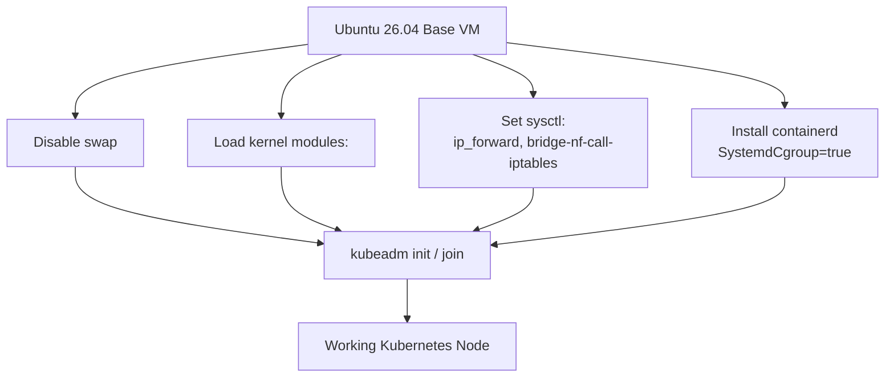

# 06 — Kubernetes Prerequisites

## Overview

Before `kubeadm` can initialize a control plane or join a worker, every node — `master`, `worker1`, and `worker2` — must have an identical set of OS-level prerequisites in place: a container runtime, disabled swap, specific kernel modules loaded, and specific `sysctl` network parameters set. This document explains each requirement and why `kubeadm` refuses to proceed without it. The companion script [scripts/install-kubernetes.sh](../scripts/install-kubernetes.sh) automates every step below and should be run identically on all three nodes.

---

## Why These Prerequisites Exist



Kubernetes assumes a specific baseline kernel and runtime configuration on every node. `kubeadm` actively checks for several of these at `init`/`join` time and will **refuse to proceed** (or `kubelet` will crash-loop after joining) if they're missing.

---

## Step 1: Disable Swap

```bash
sudo swapoff -a
sudo sed -i '/ swap / s/^/#/' /etc/fstab
```

**Why:** The `kubelet` is explicitly designed around the assumption that memory limits set on pods are meaningful and enforceable. If swap is enabled, a pod that exceeds its memory limit can be silently paged to disk instead of being OOM-killed, which breaks Kubernetes' memory-based scheduling and eviction guarantees. `kubeadm init`/`join` will fail pre-flight checks with an explicit swap-related error if this isn't done.

`sed` comments out any swap line in `/etc/fstab` so swap stays disabled across reboots — `swapoff -a` alone only affects the running session.

## Step 2: Load Required Kernel Modules

```bash
cat <<EOF | sudo tee /etc/modules-load.d/k8s.conf
overlay
br_netfilter
EOF

sudo modprobe overlay
sudo modprobe br_netfilter
```

| Module | Purpose |
|---|---|
| `overlay` | The `overlayfs` filesystem driver, used by containerd as its default storage driver for container image layers — without it, containerd cannot create the layered filesystem each container runs on. |
| `br_netfilter` | Allows `iptables`/`netfilter` rules to see and filter traffic crossing a Linux bridge (such as the CNI's pod network bridge). Without this, `kube-proxy`/CNI iptables rules silently fail to apply to bridged pod traffic, and pod-to-pod or pod-to-service traffic breaks unpredictably. |

`/etc/modules-load.d/k8s.conf` ensures both modules are loaded automatically on every boot, not just for the current session.

## Step 3: Configure Required `sysctl` Parameters

```bash
cat <<EOF | sudo tee /etc/sysctl.d/k8s.conf
net.bridge.bridge-nf-call-iptables  = 1
net.bridge.bridge-nf-call-ip6tables = 1
net.ipv4.ip_forward                 = 1
EOF

sudo sysctl --system
```

| Parameter | Purpose |
|---|---|
| `net.bridge.bridge-nf-call-iptables` | Ensures IPv4 traffic crossing a bridge is passed through `iptables`, which `kube-proxy` and Cilium rely on for Service routing and NetworkPolicy enforcement. |
| `net.bridge.bridge-nf-call-ip6tables` | Same, for IPv6 — set for completeness/future-proofing even in this IPv4-only cluster. |
| `net.ipv4.ip_forward` | Allows the node's kernel to forward IP packets between interfaces — required for pod-to-pod traffic that crosses the node's network namespace boundaries. (This is conceptually related to, but a distinct setting from, the `ip_forward` enabled on the Proxmox **host** in [02-Proxmox-Networking.md](02-Proxmox-Networking.md) — that one is for VM NAT; this one is for pod networking inside each guest.) |

## Step 4: Install containerd

```bash
sudo apt update
sudo apt install -y containerd

sudo mkdir -p /etc/containerd
containerd config default | sudo tee /etc/containerd/config.toml
```

Generate the default config, then set the critical cgroup driver option:

```bash
sudo sed -i 's/SystemdCgroup = false/SystemdCgroup = true/' /etc/containerd/config.toml
sudo systemctl restart containerd
sudo systemctl enable containerd
```

**Why `SystemdCgroup = true` matters:** Ubuntu 26.04 (like all modern systemd-based distributions) uses `systemd` as its cgroup manager (`cgroup v2`). If containerd is left with `SystemdCgroup = false` (the `cgroupfs` driver), you end up with **two different cgroup managers** on the same node — `systemd` for the OS/`kubelet` and `cgroupfs` for containers — each with its own view of resource accounting. This mismatch is a well-known source of node instability under load and is explicitly called out in the upstream Kubernetes documentation as required to fix. `kubelet` itself is configured (by `kubeadm`) to also use the `systemd` cgroup driver, so both must agree.

## Step 5: Install `kubeadm`, `kubelet`, `kubectl` (v1.34)

```bash
sudo apt install -y apt-transport-https ca-certificates curl gpg

curl -fsSL https://pkgs.k8s.io/core:/stable:/v1.34/deb/Release.key | \
  sudo gpg --dearmor -o /etc/apt/keyrings/kubernetes-apt-keyring.gpg

echo 'deb [signed-by=/etc/apt/keyrings/kubernetes-apt-keyring.gpg] https://pkgs.k8s.io/core:/stable:/v1.34/deb/ /' | \
  sudo tee /etc/apt/sources.list.d/kubernetes.list

sudo apt update
sudo apt install -y kubelet kubeadm kubectl
sudo apt-mark hold kubelet kubeadm kubectl
```

`apt-mark hold` prevents an unattended `apt upgrade` from silently jumping to a newer Kubernetes minor version — Kubernetes minor upgrades require a deliberate, controlled process (drain → upgrade → uncordon), not an automatic package update.

---

## Verification

```bash
swapon --show                      # expect: empty output (no swap active)
lsmod | grep -E 'overlay|br_netfilter'   # expect: both modules listed
sysctl net.ipv4.ip_forward         # expect: = 1
systemctl is-active containerd     # expect: active
kubeadm version
kubelet --version
kubectl version --client
```

All three nodes should report identical `kubeadm`/`kubelet`/`kubectl` versions (`v1.34.x`).

---

## Common Mistakes

| Mistake | Consequence | Fix |
|---|---|---|
| Running `swapoff -a` without editing `/etc/fstab` | Swap silently re-enables on next reboot, and `kubelet` may crash-loop after a restart | Comment out swap in `/etc/fstab` as shown in Step 1 |
| Leaving containerd's `SystemdCgroup = false` | Node joins the cluster but reports instability/high resource pressure under load | Explicitly set `SystemdCgroup = true` and restart containerd |
| Installing different Kubernetes versions across nodes | `kubeadm join` may fail, or the cluster works but is running in an unsupported, mismatched-version state | Pin the exact same `pkgs.k8s.io` core version stream (`v1.34`) on every node |
| Skipping `apt-mark hold` | An unattended-upgrades job silently upgrades `kubelet` mid-operation, potentially breaking cluster compatibility | Hold the three Kubernetes packages as shown in Step 5 |

---

## Troubleshooting

**Symptom: `kubeadm init` pre-flight check fails with `[ERROR Swap]: running with swap on is not supported`.**
Confirm `swapon --show` truly returns nothing — if it still shows an active swap device, `swapoff -a` may not have targeted a swap file/partition correctly, or `/etc/fstab` re-enabled it on a previous reboot you didn't notice.

**Symptom: `kubelet` fails to start with cgroup driver errors in `journalctl -u kubelet`.**
Confirm `/etc/containerd/config.toml` truly has `SystemdCgroup = true` (a `sed` command that doesn't match due to whitespace differences will silently no-op). Check with:
```bash
grep SystemdCgroup /etc/containerd/config.toml
```

**Symptom: Pods stuck in `ContainerCreating`, `journalctl -u containerd` shows overlay-related errors.**
The `overlay` kernel module may not have loaded correctly. Confirm with `lsmod | grep overlay`; if missing, re-run `modprobe overlay` and check `dmesg` for any kernel-level error explaining why the module failed to load (rare on stock Ubuntu kernels, but possible if a custom/minimal kernel is in use).

---

## Recovery

If a node's prerequisite configuration becomes inconsistent (for example, after a bad manual edit), the cleanest recovery is to re-run [scripts/install-kubernetes.sh](../scripts/install-kubernetes.sh) in full — every step in it is idempotent (safe to re-run) and will re-assert the correct state.

---

## Best Practices

- Apply these prerequisites via the shared script (not by hand, three times) so all nodes are guaranteed identical — configuration drift between nodes is one of the most common sources of hard-to-diagnose cluster issues.
- Re-verify prerequisites after any OS-level `apt upgrade`, since kernel upgrades occasionally reset module auto-load configuration if `/etc/modules-load.d/k8s.conf` was somehow removed.

## Performance Tips

- `overlayfs` is the recommended and best-performing containerd snapshotter for typical homelab workloads; there's no practical reason to change it here.

## Security Tips

- Pin package versions with `apt-mark hold` (Step 5) not just for stability, but so that security patches within the same Kubernetes minor version are applied deliberately via a tested process rather than happening silently.

---

**Next:** [07-Kubeadm-ControlPlane.md](07-Kubeadm-ControlPlane.md) — initializing the control plane on `master`.
