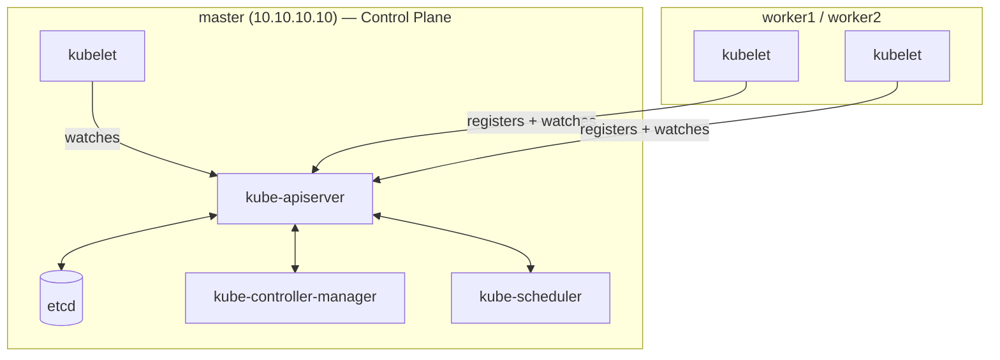

# 07 — Initializing the Control Plane with `kubeadm`

## Overview

With prerequisites satisfied on all three nodes ([06-Kubernetes-Prerequisites.md](06-Kubernetes-Prerequisites.md)), this document initializes the Kubernetes control plane on `master` (`10.10.10.10`). This creates the cluster's core components — `kube-apiserver`, `kube-controller-manager`, `kube-scheduler`, and `etcd` — and generates the join token workers will use in [08-Kubeadm-Workers.md](08-Kubeadm-Workers.md).

---

## Architecture



---

## Step 1: Run `kubeadm init`

```bash
sudo kubeadm init \
  --pod-network-cidr=10.244.0.0/16 \
  --apiserver-advertise-address=10.10.10.10 \
  --control-plane-endpoint=10.10.10.10
```

| Flag | Explanation |
|---|---|
| `--pod-network-cidr=10.244.0.0/16` | Reserves the address range Cilium will assign to pods (see [09-Cilium.md](09-Cilium.md)). This range must not overlap the lab network (`10.10.10.0/24`) or the home network (`192.168.1.0/24`) — it doesn't, by design (see [02-Proxmox-Networking.md](02-Proxmox-Networking.md)). |
| `--apiserver-advertise-address=10.10.10.10` | Explicitly pins the API server to advertise its address on the lab bridge, avoiding any ambiguity if the VM ever has more than one interface. |
| `--control-plane-endpoint=10.10.10.10` | Sets a stable endpoint address for the control plane. In a single-control-plane homelab this is the same as the advertise address, but setting it explicitly here means the cluster **could** later be converted to a highly-available multi-control-plane setup without re-issuing every client's kubeconfig — a forward-looking best practice even for a 1-control-plane cluster. |

**Expected output** (abbreviated):

```
Your Kubernetes control-plane has initialized successfully!

To start using your cluster, you need to run the following as a regular user:

  mkdir -p $HOME/.kube
  sudo cp -i /etc/kubernetes/admin.conf $HOME/.kube/config
  sudo chown $(id -u):$(id -g) $HOME/.kube/config

...

Then you can join any number of worker nodes by running the following on each as root:

kubeadm join 10.10.10.10:6443 --token <token> \
    --discovery-token-ca-cert-hash sha256:<hash>
```

> **Warning:** This output contains the `kubeadm join` command with a live token — copy it somewhere safe immediately. Tokens expire after 24 hours by default; if you miss this window, generate a new one as shown in the Recovery section below rather than trying to reconstruct it from memory.

## Step 2: Configure `kubectl` Access for the Admin User

```bash
mkdir -p $HOME/.kube
sudo cp -i /etc/kubernetes/admin.conf $HOME/.kube/config
sudo chown $(id -u):$(id -g) $HOME/.kube/config
```

This copies the cluster's auto-generated admin credentials into your regular user's kubeconfig location, so `kubectl` works without `sudo` going forward — matching how [12-Mac-Kubectl.md](12-Mac-Kubectl.md) later copies this same file to your Mac.

## Step 3: Confirm the Control Plane Is Up (Before Installing a CNI)

```bash
kubectl get nodes
```

**Expected output at this stage:**

```
NAME     STATUS     ROLES           AGE   VERSION
master   NotReady   control-plane   1m    v1.34.x
```

> **Note:** `NotReady` is **expected and correct** at this point. A node cannot report `Ready` until a CNI (Container Network Interface) plugin is installed, because the `kubelet` cannot fully initialize pod networking without one. This is resolved in [09-Cilium.md](09-Cilium.md) — do not troubleshoot `NotReady` yet at this stage.

```bash
kubectl get pods -A
```

**Expected output:** `kube-apiserver`, `etcd`, `kube-scheduler`, and `kube-controller-manager` pods in the `kube-system` namespace, all `Running`. `coredns` pods will show `Pending` — also expected, for the same CNI-related reason above.

---

## Verification

```bash
kubectl cluster-info
kubectl get componentstatuses 2>/dev/null || kubectl get --raw='/healthz?verbose'
```

`kubectl cluster-info` should report the control plane URL as `https://10.10.10.10:6443`. The `/healthz?verbose` check confirms individual control-plane components report `ok`.

---

## Common Mistakes

| Mistake | Consequence | Fix |
|---|---|---|
| Running `kubeadm init` without `--pod-network-cidr` | Cilium (or any CNI) install later fails or defaults to an unexpected range | Always specify `--pod-network-cidr=10.244.0.0/16` explicitly at init time |
| Treating `NotReady` immediately after init as a bug | Wasted troubleshooting time before the CNI step | Recognize this as expected; proceed to [09-Cilium.md](09-Cilium.md) |
| Losing the `kubeadm join` command/token before joining workers | Must regenerate the token to join workers | Save the full `kubeadm init` output immediately, or regenerate per the Recovery section |
| Running `kubeadm init` a second time after a failed first attempt without resetting | Confusing, partially-applied cluster state | Run `sudo kubeadm reset` (or [scripts/reset-node.sh](../scripts/reset-node.sh)) before retrying |

---

## Troubleshooting

**Symptom: `kubeadm init` fails at the `[kubelet-check]` phase.**
Check `journalctl -u kubelet -f` in a second terminal while re-running `kubeadm init` — this almost always surfaces a prerequisite issue from [06-Kubernetes-Prerequisites.md](06-Kubernetes-Prerequisites.md) (swap still enabled, cgroup driver mismatch, or a missing kernel module) rather than a `kubeadm` bug itself.

**Symptom: `kubectl get nodes` returns `The connection to the server localhost:8080 was refused`.**
This means `kubectl` cannot find a valid kubeconfig and is falling back to its hardcoded default of `localhost:8080` (a legacy default with no TLS, which will never work against a real cluster). Fix by completing Step 2 above (`cp /etc/kubernetes/admin.conf ~/.kube/config`) and confirming `$KUBECONFIG` isn't overriding it to a bad path (`echo $KUBECONFIG`).

**Symptom: `kubeadm init` succeeds but `etcd` pod crash-loops.**
Frequently a disk-space or resource-pressure issue on constrained VMs. Check `df -h` and `free -h` on `master`; a 2 GB RAM control-plane node with other load on the same Proxmox host can occasionally hit resource pressure, discussed in [14-Best-Practices.md](14-Best-Practices.md).

---

## Recovery

**To fully reset and re-initialize the control plane:**

```bash
sudo kubeadm reset -f
sudo rm -rf /etc/cni/net.d
rm -rf $HOME/.kube
sudo kubeadm init --pod-network-cidr=10.244.0.0/16 \
  --apiserver-advertise-address=10.10.10.10 \
  --control-plane-endpoint=10.10.10.10
```

[scripts/reset-node.sh](../scripts/reset-node.sh) automates the reset half of this sequence and is safe to run on any node (control plane or worker).

**To regenerate a join token after the original expired:**

```bash
kubeadm token create --print-join-command
```

---

## Best Practices

- Always capture the full `kubeadm init` output to a file (`kubeadm init ... | tee kubeadm-init.log`) — the join command and CA hash are needed again in [08-Kubeadm-Workers.md](08-Kubeadm-Workers.md) and are otherwise painful to reconstruct.
- Take a Proxmox snapshot of `master` immediately after a successful `kubeadm init` and before installing Cilium — this gives you an easy rollback point that isolates whether a future issue originates in the control plane or in the CNI layer.

## Performance Tips

- `etcd` is latency-sensitive; keeping the control plane's virtual disk on the same 256 GB SSD as the rest of the homelab (rather than the 1 TB HDD reserved for storage) is a meaningful and intentional performance decision made in [03-Ubuntu-Template.md](03-Ubuntu-Template.md).

## Security Tips

- `admin.conf` grants full cluster-admin access — treat it exactly like a root credential. Never copy it outside of `$HOME/.kube/config` on trusted machines, and never commit it to this repository (already excluded via [.gitignore](../.gitignore)).
- Join tokens are valid for 24 hours by default specifically to limit the window in which a leaked token could be used to join a rogue node — don't extend this window casually with `--ttl 0` unless you have a specific operational reason to.

---

**Next:** [08-Kubeadm-Workers.md](08-Kubeadm-Workers.md) — joining `worker1` and `worker2` to the cluster.
