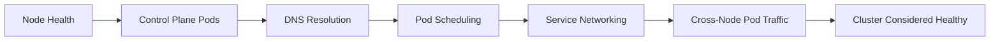

# 10 — Cluster Validation

## Overview

This document runs the cluster through a structured set of end-to-end checks that go beyond "kubectl get nodes says Ready." The goal is to prove — not assume — that scheduling, DNS, Service networking, storage, and cross-node pod communication all genuinely work before declaring the build complete.

---

## Validation Checklist



## 1. Node Health

```bash
kubectl get nodes -o wide
```

**Expected:** all three nodes `Ready`, correct `INTERNAL-IP` per node (`10.10.10.10/11/12`), and `KERNEL-VERSION`/`CONTAINER-RUNTIME` columns showing `containerd://...` consistently across all three.

## 2. Control Plane and System Pods

```bash
kubectl get pods -n kube-system -o wide
```

**Expected:** every pod `Running`, `RESTARTS` at or near `0` (a handful of restarts during initial bring-up is normal; continuously climbing restarts is not). Confirm one `cilium-*` pod per node and one `coredns` pod pair.

## 3. DNS Resolution

```bash
kubectl run dns-test --image=busybox:1.36 --restart=Never --rm -it -- \
  nslookup kubernetes.default
```

**Expected output:**

```
Server:    10.96.0.10
Address:   10.96.0.10:53

Name:      kubernetes.default.svc.cluster.local
Address:   10.96.0.1
```

This confirms `coredns` correctly resolves the cluster's own `kubernetes` Service — the single most common early failure point in a fresh cluster.

## 4. Pod Scheduling Across All Nodes

```bash
kubectl create deployment nginx-test --image=nginx:1.27 --replicas=6
kubectl get pods -o wide -l app=nginx-test
```

**Expected:** 6 pods `Running`, spread across `master`, `worker1`, and `worker2` roughly evenly (the default scheduler spreads replicas across nodes when resources allow). If all 6 land on a single node, check `kubectl describe nodes` for resource pressure on the others.

## 5. Service Networking (ClusterIP + Load Balancing)

```bash
kubectl expose deployment nginx-test --port=80 --target-port=80
kubectl run curl-test --image=curlimages/curl:8.9.1 --restart=Never --rm -it -- \
  curl -s nginx-test.default.svc.cluster.local
```

**Expected output:** the default `nginx` welcome page HTML, confirming the Service's `ClusterIP` correctly load-balances to the backing pods via Cilium's `kubeProxyReplacement` data plane (see [09-Cilium.md](09-Cilium.md)).

## 6. Cross-Node Pod-to-Pod Connectivity

```bash
cilium connectivity test
```

Already introduced in [09-Cilium.md](09-Cilium.md) — re-run it here as part of the formal validation record. **Expected:** all test cases pass.

## 7. Cleanup

```bash
kubectl delete deployment nginx-test
kubectl delete service nginx-test
```

---

## Verification Summary Table

| Check | Command | Expected Result |
|---|---|---|
| Node health | `kubectl get nodes` | 3/3 `Ready` |
| System pods | `kubectl get pods -n kube-system` | All `Running`, low restart count |
| DNS | `nslookup kubernetes.default` from a test pod | Resolves to `10.96.0.1` |
| Scheduling | 6-replica deployment | Pods spread across all 3 nodes |
| Service networking | `curl` a ClusterIP Service | Returns expected HTTP response |
| Cross-node networking | `cilium connectivity test` | All tests pass |

---

## Common Mistakes

| Mistake | Consequence | Fix |
|---|---|---|
| Declaring the cluster "done" once `kubectl get nodes` shows `Ready` | Misses real problems in DNS, Service networking, or cross-node traffic that only surface under actual workload | Run the full checklist above, not just node status |
| Forgetting to clean up test workloads | Test `nginx`/`curl` pods linger, consuming scarce RAM on 2 GB worker nodes | Always run the Step 7 cleanup commands |
| Testing scheduling with only 1 replica | Doesn't actually prove the scheduler spreads pods correctly | Use enough replicas (e.g. 6 across 3 nodes) to meaningfully observe distribution |

---

## Troubleshooting

**Symptom: `nslookup` from the test pod times out.**
Confirm `coredns` pods are `Running` and not `CrashLoopBackOff` (`kubectl -n kube-system get pods -l k8s-app=kube-dns`). If they're healthy but resolution still fails, check `kubectl -n kube-system logs -l k8s-app=kube-dns` for upstream DNS forwarding errors — `coredns` forwards external queries to the host's `/etc/resolv.conf`, which on these VMs points at `1.1.1.1`/`8.8.8.8` per [04-Cloning-VMs.md](04-Cloning-VMs.md).

**Symptom: `curl` to the Service ClusterIP hangs or times out.**
Re-run `cilium connectivity test` in isolation — if it also fails, the issue is CNI-level (see [09-Cilium.md](09-Cilium.md)'s troubleshooting section), not specific to this particular Service.

**Symptom: All test pods schedule onto `master` only.**
By default, `kubeadm init` taints the control-plane node (`node-role.kubernetes.io/control-plane:NoSchedule`) so regular workloads should **not** land there. If pods are landing exclusively on `master`, check whether that taint was accidentally removed:
```bash
kubectl describe node master | grep Taints
```

---

## Recovery

If validation reveals a specific broken layer (DNS, scheduling, networking), recovery is layer-specific:
- DNS issues → restart `coredns`: `kubectl -n kube-system rollout restart deployment coredns`
- Networking issues → revisit [09-Cilium.md](09-Cilium.md)'s Recovery section
- Node-level issues → revisit [06-Kubernetes-Prerequisites.md](06-Kubernetes-Prerequisites.md) on the affected node

---

## Best Practices

- Re-run this entire validation checklist after any cluster-affecting change (Kubernetes version upgrade, Cilium upgrade, node re-join) — not just at initial build time.
- Keep the validation commands in this document, rather than only in your shell history, so the exact same checks can be repeated identically after future changes.

## Performance Tips

- Watch `kubectl top nodes` (requires `metrics-server`, not yet installed in this base build — see [15-Roadmap.md](15-Roadmap.md)) once available, to confirm the 6-replica scheduling test didn't push any node into memory pressure on 2 GB worker VMs.

## Security Tips

- Test workloads (`nginx-test`, `curl-test`) use unauthenticated, publicly pullable images purely for connectivity validation — do not leave them running longer than the validation window, and always complete the Step 7 cleanup.

---

**Next:** [11-Samba.md](11-Samba.md) — mounting the 1TB HDD and sharing it via Samba.
