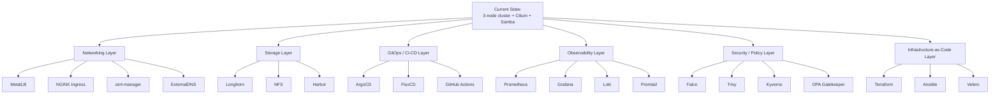

# 15 — Future Roadmap

## Overview

This homelab is intentionally built in layers, starting from bare-metal virtualization up through a validated, `Ready` Kubernetes cluster with basic network storage. This document lays out the next set of additions, grouped by function, along with why each is a logical next step and roughly where it fits relative to the others.

---

## Roadmap Overview

---

## Networking Layer

| Tool | Purpose | Why It's Next |
|---|---|---|
| **MetalLB** | Provides `LoadBalancer`-type Service support on bare-metal/homelab clusters (which have no cloud provider to allocate real load balancers) | Without it, `Service type=LoadBalancer` never gets an external IP — this is the first thing needed before any Ingress controller can be reached from outside the cluster |
| **NGINX Ingress** | HTTP(S) reverse-proxy/routing into the cluster, backed by a MetalLB-assigned IP | Enables hosting multiple HTTP services behind one entry point using host/path-based routing |
| **cert-manager** | Automates TLS certificate issuance/renewal (e.g. via Let's Encrypt or a self-signed CA for internal-only services) | Removes manual certificate management once real services are exposed via Ingress |
| **ExternalDNS** | Automatically manages DNS records for Ingress/Service resources | More relevant once a real domain is pointed at the homelab; lower priority for a fully internal-only setup |

## Storage Layer

| Tool | Purpose | Why It's Next |
|---|---|---|
| **Longhorn** | Cloud-native, replicated block storage for Kubernetes `PersistentVolume`s | The current Samba share is host-level storage, not Kubernetes-native — Longhorn would let workloads request `PersistentVolumeClaim`s that survive pod rescheduling across nodes |
| **NFS** | Simpler, non-replicated shared storage option, usable via the `nfs-subdir-external-provisioner` or similar | A lighter-weight alternative to Longhorn for workloads that don't need replication |
| **Harbor** | Self-hosted container registry with vulnerability scanning and image signing | Useful once you're building custom images regularly, rather than pulling only from public registries |

## GitOps / CI-CD Layer

| Tool | Purpose | Why It's Next |
|---|---|---|
| **ArgoCD** | Declarative, Git-based continuous delivery for Kubernetes — reconciles cluster state to match a Git repository | Turns this repository (or a workloads repo alongside it) into the source of truth for what's actually running in the cluster |
| **FluxCD** | Alternative GitOps engine to ArgoCD — likely to evaluate one, not necessarily adopt both | Same goal as ArgoCD via a different architecture (pull-based operator model) |
| **GitHub Actions** | CI pipelines for building/testing container images before they reach the cluster | Pairs naturally with Harbor and ArgoCD/FluxCD to form a full build → publish → deploy pipeline |

## Observability Layer

| Tool | Purpose | Why It's Next |
|---|---|---|
| **Prometheus** | Metrics collection and alerting | The current cluster has no metrics pipeline at all beyond `kubectl top` (which itself requires `metrics-server`, not yet installed) |
| **Grafana** | Dashboards on top of Prometheus (and Loki) data | Pairs directly with Prometheus; makes resource-constraint issues discussed in [14-Best-Practices.md](14-Best-Practices.md) visible over time rather than anecdotal |
| **Loki** | Log aggregation, designed to pair with Grafana the way Prometheus does for metrics | Centralizes logs currently scattered across `kubectl logs` per-pod and `journalctl` per-node |
| **Promtail** | Log shipping agent that feeds Loki | Required companion to Loki — runs as a DaemonSet collecting node/pod logs |

## Security / Policy Layer

| Tool | Purpose | Why It's Next |
|---|---|---|
| **Falco** | Runtime security monitoring — detects anomalous syscall behavior inside containers | Useful once real, less-trusted workloads run on the cluster; less critical while it's just validation/test pods |
| **Trivy** | Vulnerability scanning for container images (and IaC manifests) | Natural pairing with Harbor — scan images at push time before they're ever deployed |
| **Kyverno** | Kubernetes-native policy engine, written in YAML (no new DSL to learn) | Lower barrier to entry than OPA Gatekeeper for enforcing basic policies (no `:latest` tags, required labels, no privileged pods) |
| **OPA Gatekeeper** | Policy engine using the Rego language, more expressive than Kyverno for complex policies | Likely evaluated *instead of*, not *in addition to*, Kyverno depending on which policy authoring style fits better |

## Infrastructure-as-Code Layer

| Tool | Purpose | Why It's Next |
|---|---|---|
| **Terraform** | Declarative provisioning of Proxmox VMs (via the `bpg/proxmox` or `telmate/proxmox` provider) | Would replace the manual `qm` commands in [03-Ubuntu-Template.md](03-Ubuntu-Template.md)/[04-Cloning-VMs.md](04-Cloning-VMs.md) with version-controlled, reproducible VM definitions |
| **Ansible** | Configuration management for OS-level prerequisites across nodes | Would replace/formalize [scripts/install-kubernetes.sh](../scripts/install-kubernetes.sh) as an idempotent, inventory-driven playbook rather than a script run manually per node |
| **Velero** | Backup and disaster recovery for Kubernetes cluster resources and persistent volumes | Complements [scripts/backup-config.sh](../scripts/backup-config.sh) with a Kubernetes-native, restorable backup format, especially valuable once Longhorn-backed persistent data exists |

---

## Suggested Sequencing

While these can be adopted in any order based on interest, a reasonable dependency-aware sequence is:

1. **MetalLB → NGINX Ingress → cert-manager** (networking foundation — needed before exposing any real service)
2. **Prometheus → Grafana** (observability — valuable immediately, and helps validate every subsequent addition)
3. **Longhorn** (Kubernetes-native storage — needed before stateful workloads become interesting)
4. **Harbor → Trivy** (registry + scanning — needed before building custom images regularly)
5. **ArgoCD or FluxCD → GitHub Actions** (GitOps/CI — ties everything together once there's something worth deploying via Git)
6. **Kyverno or OPA Gatekeeper → Falco** (policy and runtime security — layer on once the cluster hosts real, less-trivial workloads)
7. **Terraform → Ansible → Velero** (formalize the entire build described in this repository as reproducible, version-controlled infrastructure)

---

## Contributing to the Roadmap

As each item above is implemented, it should get its own numbered document (continuing from `16-`) following the same structure used throughout this repository: Architecture, Step-by-step commands, Explanation, Expected output, Verification, Troubleshooting, Common mistakes, Recovery, Best practices, Performance tips, and Security tips.

---

**This concludes the core documentation set.** Return to the [README](../README.md) for the full repository index.
